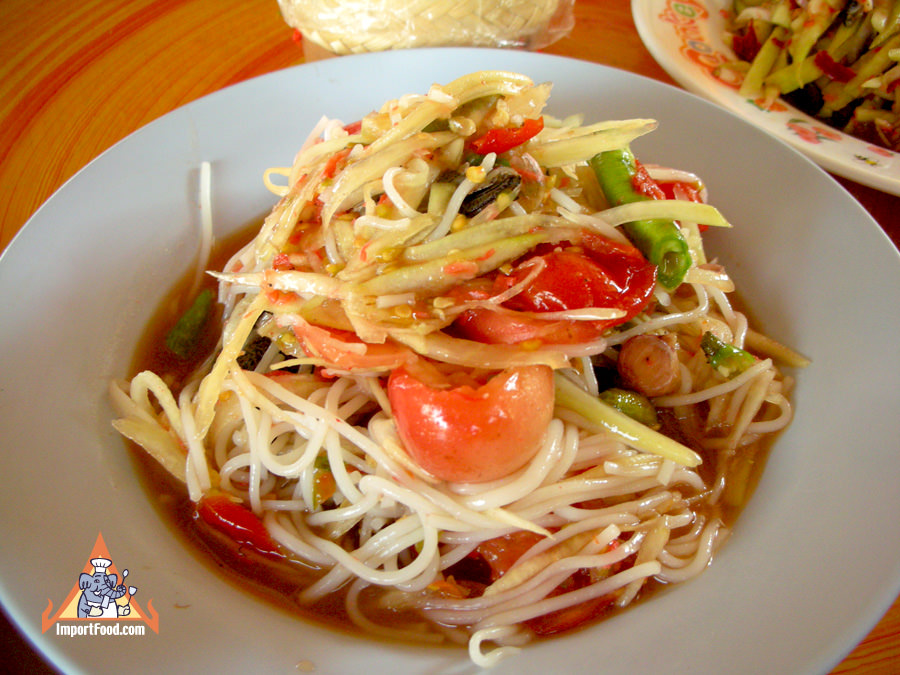
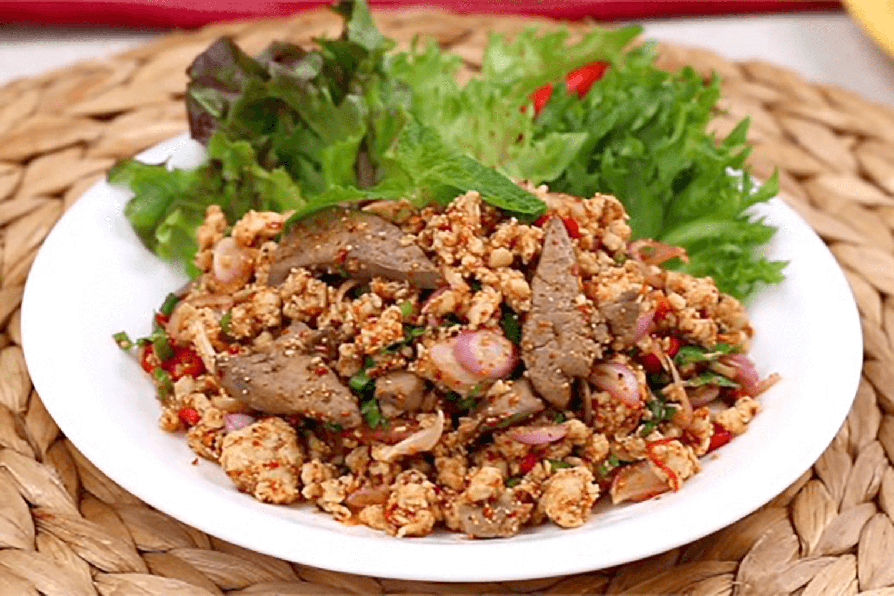
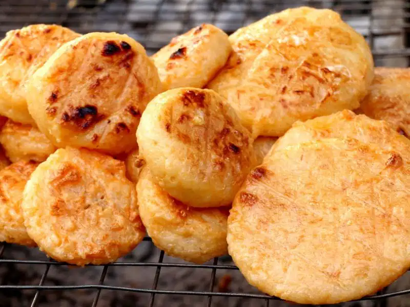
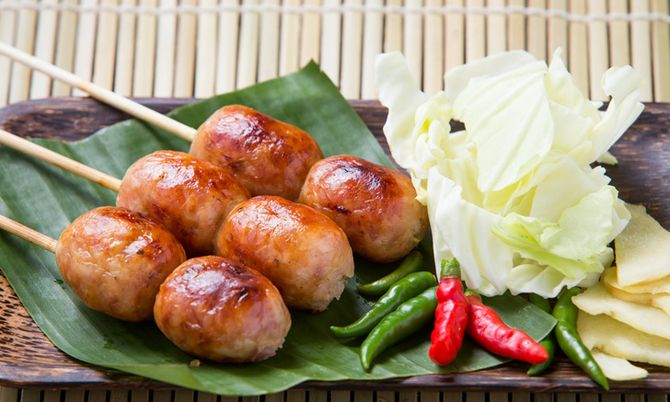
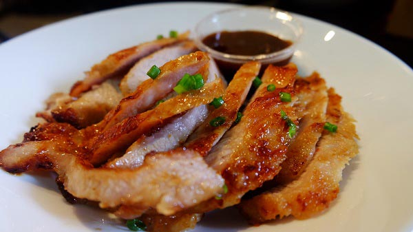
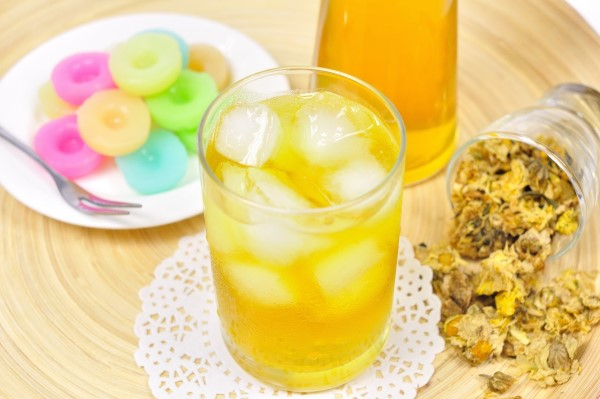

## Menu

[First Food Section](#first-food-section) | [Isan Food](#isan-Food) | [Beverages](#beverages)

## Isan Food
| Name         | Description                                                               | Image                              | Price |
|--------------|---------------------------------------------------------------------------|------------------------------------|-------|
| Som Tum      | Crispy green papaya slice with a mixed of vegatables and meats            |       | 60    |
| Larb         | Minced meat mixed with spices and lime for more flavors                   |         | 70    |
| Khao Gee     | Cooked sticky rice and frilled with a coating or salts and eggs           |      | 15    |
| Isan Sausage | fermented pork meat and fat mixed with cooked rice, grill with garlic and salt |  | 20    |
| Kor Moo Yang| Grilled pork neck, marinated with special sauces|  | 80    |

## Beverages
| Beverages name         | Description                                     | Image | Price |
|------------------------|-------------------------------------------------|-------|-------|
| Chrysanthemum Iced Tea | A little bit sweet tea with Chrysanthemum scent || 15    |
> A table of beverages. Each team member adds one beverage (one row) to the table.
> Result should be in alphabetical order by beverage name.
