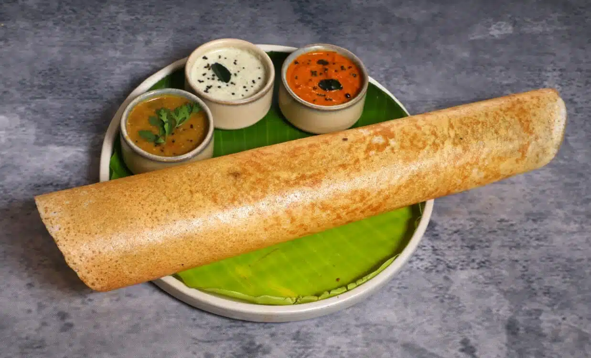
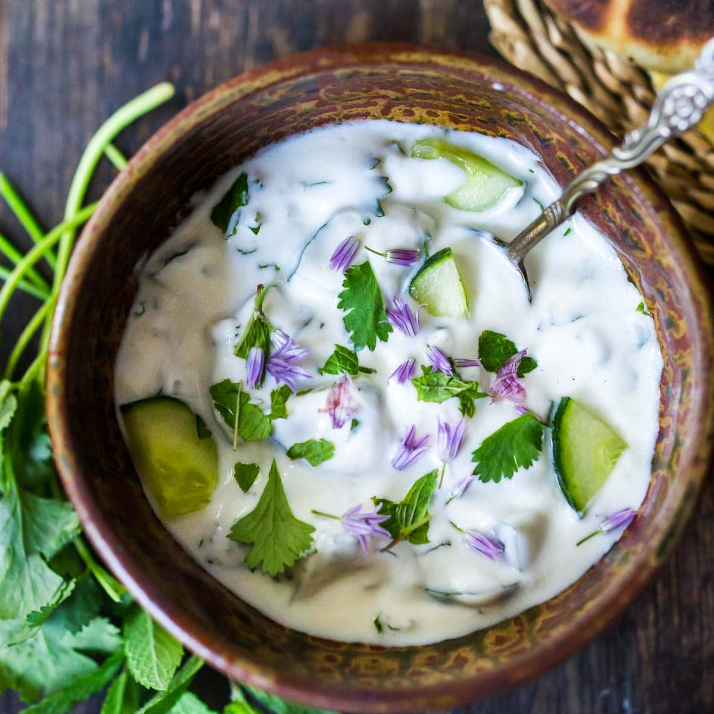
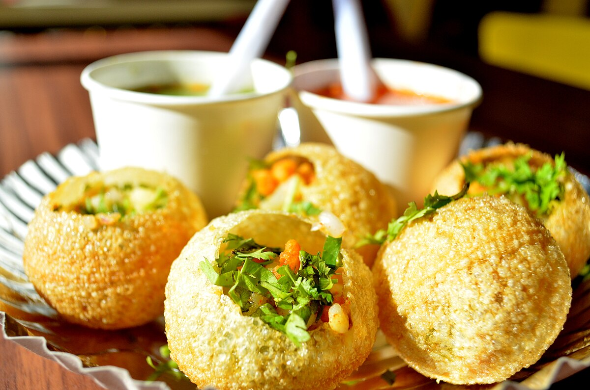
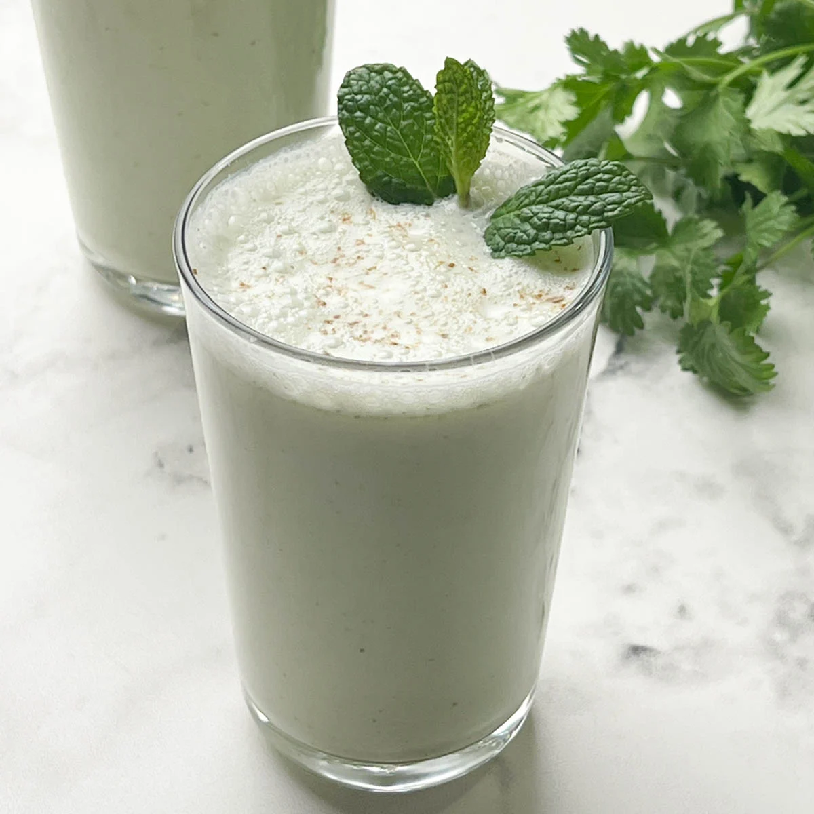

## Menu

[Indian Food](#indian-food) | ... | [Beverages](#beverages)

## Indian Food
| Name          | Description                                                                                                                                         | Image                                | Price |
|---------------|-----------------------------------------------------------------------------------------------------------------------------------------------------|--------------------------------------|-------|
| Pakora        | A fritter consists of any vegetables (often potatoes and onions) which are coated in seasoned gram flour batter and deep fried.                     |         | 130   |
| Murgh Makhani | Curry made from chicken with a spiced tomato and butter (makhan) sauce.                                                                             |  | 160   |
| Dosa          | A thin, savoury hot crepe made from a fermented batter of ground black gram and rice.                                                               |           | 70    |
| Raita         | A side dish made of dahi (yogurt) with raw, cooked vegetables, or fruit.                                                                            |          | 80    |
| Pani Puri     | A deep-fried breaded hollow spherical shell, about 1 inch in diameter, filled with a combination of finely diced potato, onion, peas, and chickpea. |      | 70    |

## Beverages
| Beverages name | Description                                          | Image                        | Price |
|----------------|------------------------------------------------------|------------------------------|-------|
| Chaas          | A curd-based drink, often referred to as buttermilk. |  | 30    |
> A table of beverages. Each team member adds one beverage (one row) to the table.
> Result should be in alphabetical order by beverage name.
