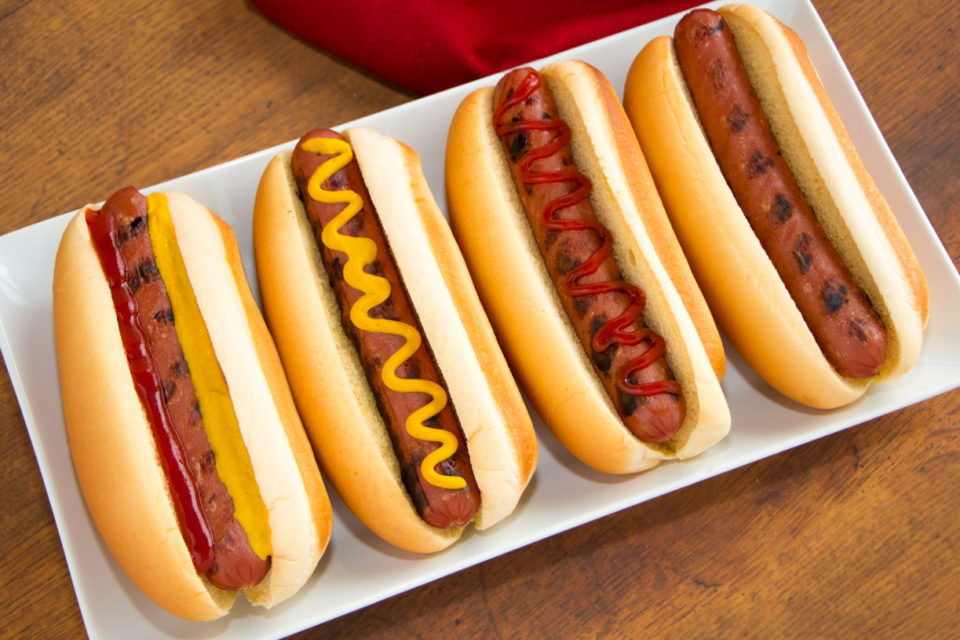
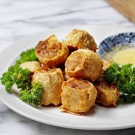
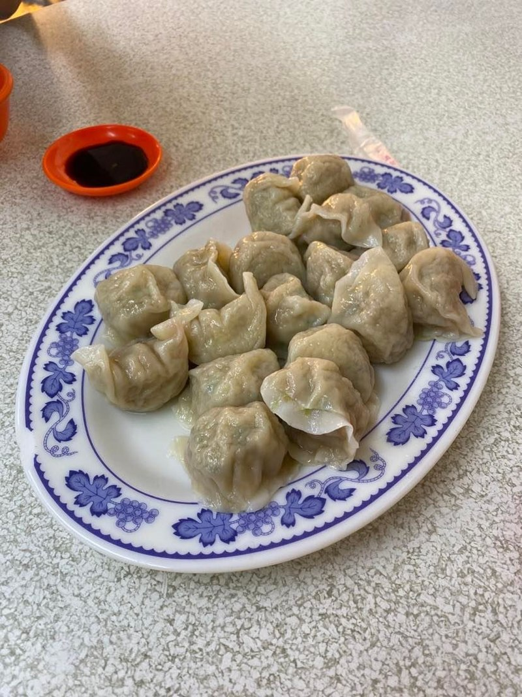
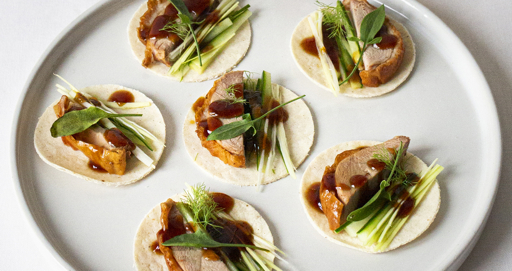
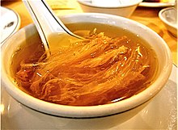
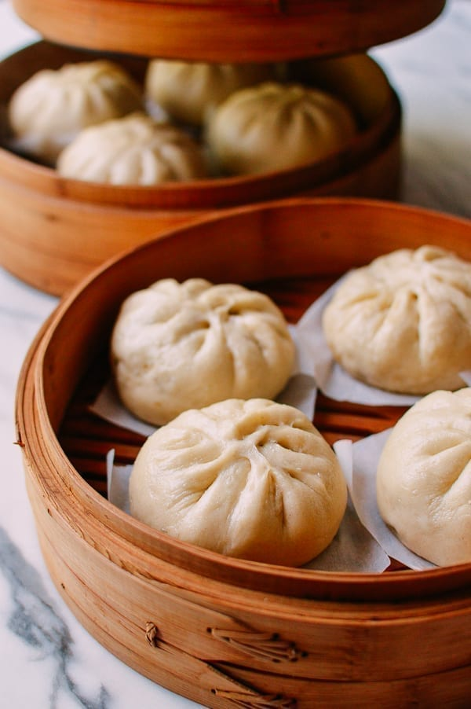
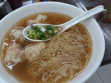

## Menu
[Isan Food](#isan-Food) | [Vietnamese food](#Vietnamese-food) | [American Food](#american-food) | [Chinese Food](#Chinese-food) | [Beverages](#beverages) 
Note: All prices are in THB

## Vietnamese food
| Name                | Description                                                                                               | Image                             | Price |
|:--------------------|:----------------------------------------------------------------------------------------------------------|-----------------------------------|------:|
| Beef Pho (phở bò)   | Delicious rice noodles with beef, servered with delicious herb broth.                                     |  |    40 |        
| Ga nuong (gà nướng) | Tender roast chicken marinated with honey and grilled.                                                    |  |   280 |
 | Cha gio (Chả giò)   | Crispy deep fried egg rolls severed with sweet dipping sauce.                                             |    |    50 |
| Banh mi (Bánh mì)   | Short baguette with a thin, crisp crust and a soft, airy texture.   Stuffed with meat and vegetables. |    |    60 |
| Ga tan (gà tần)    | Vietnamese style chicken soup.                                                                            |      |    60 |

## Isan Food
| Name         | Description                                                               | Image                              | Price |
|--------------|---------------------------------------------------------------------------|------------------------------------|-------|
| Som Tum      | Crispy green papaya slice with a mixed of vegatables and meats            |       | 60    |
| Larb         | Minced meat mixed with spices and lime for more flavors                   |         | 70    |
| Khao Gee     | Cooked sticky rice and frilled with a coating or salts and eggs           |      | 15    |
| Isan Sausage | fermented pork meat and fat mixed with cooked rice, grill with garlic and salt |  | 20    |
| Kor Moo Yang| Grilled pork neck, marinated with special sauces|  | 80    |

## American Food
| Name                    | Description                                                                                                                                                                                                                                                                                                 | Image                                    | Price |
|-------------------------|-------------------------------------------------------------------------------------------------------------------------------------------------------------------------------------------------------------------------------------------------------------------------------------------------------------|------------------------------------------|-------|
| Cheeseburger            | A cheeseburger is a hamburger with a slice of melted cheese on top of the meat patty, added near the end of the cooking time. Cheeseburgers can include variations in structure, ingredients and composition.                                                                                               |       | 70    |
| Frensh Fries            | French fries, side dish or snack typically made from deep-fried potatoes that have been cut into various shapes, especially thin strips.  Fries are often salted and served with other items, including ketchup, mayonnaise, or vinegar.                                                                |     | 35+   |
| Grilled Cheese Sandwich | A grilled cheese sandwich is made by placing a cheese filling, often cheddar or American cheese, between two slices of bread, which is then heated until the bread browns and the cheese melts. A layer of butter or mayonnaise may be added to the outside of the bread for additional flavor and texture. |   | 160   |
| Mashed Potato           | Mashed potato or mashed potatoes (American, Canadian and Australian English), colloquially known as mash (British English), is a dish made by mashing boiled or steamed potatoes, usually with added milk, butter, salt and pepper. It is generally served as a side dish to meat or vegetables.            |  | 70    |
| Hot Dog                 | A hot dog is a dish consisting of a grilled, steamed, or boiled sausage served in the slit of a partially sliced bun. The term hot dog can refer to the sausage itself. The sausage used is a wiener (Vienna sausage) or a frankfurter (Frankfurter Würstchen, also just called frank).                     |           | 30+   |

## Chinese Food
| Name | Description | Image | Price |
|------|-------------|-------|-------|
| Deep-fried crab meat rolls | Crispy dough wraps around the crab meat in cylindrical shape |  | 180 |
| Jiaozi | Jiaozi consists of ground meat and vegetable filling in a piece of thin dough |  | 60 |
| Peking duck | Crispy skin of duck serving with pancake rolls, cucumber, spring onion and sweet bean sauce |  | 500 |
| Shark fin soup | Soup or stewed of shark fin that provides you nice texture |  | 2500 |
| Steamed pork bun | Hydrated white flatten ball shaped dough contains pork inside |  | 20 |
| Wonton noodles | Egg noodles served in hot broth with some leafy vegetable and prawn wonton dumplings |  | 60 |

## Beverages
| Beverages name         | Description                                     | Image | Price |
|------------------------|-------------------------------------------------|-------|-------|
| Ca phe trung (cà phê trứng) | Unique Vietnamese egg coffee. |  |    40 |   
| Chrysanthemum Iced Tea | A little bit sweet tea with Chrysanthemum scent || 15    |
| Green tea | A drink that comes from tea leaves and buds originated in China |  | 30 |
| MilkShake      | A sweet beverage made by blending milk, ice cream, and flavorings or sweeteners such as butterscotch, caramel sauce, chocolate syrup, or fruit syrup into a thick, sweet, cold mixture. |  | 79    |

> A table of beverages. Each team member adds one beverage (one row) to the table.
> Result should be in alphabetical order by beverage name.
